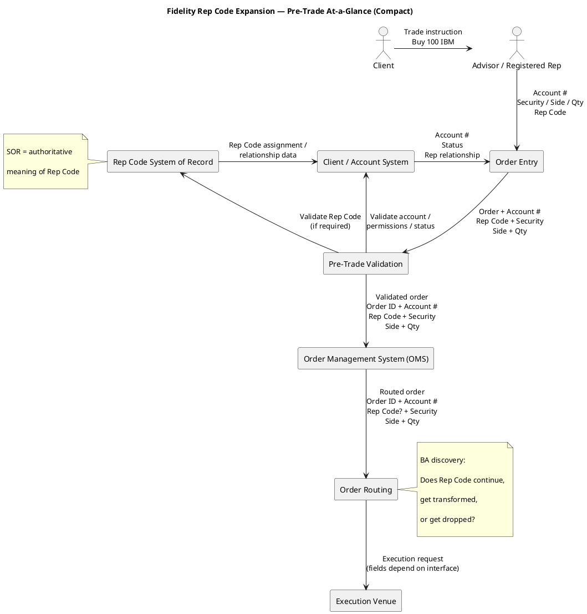
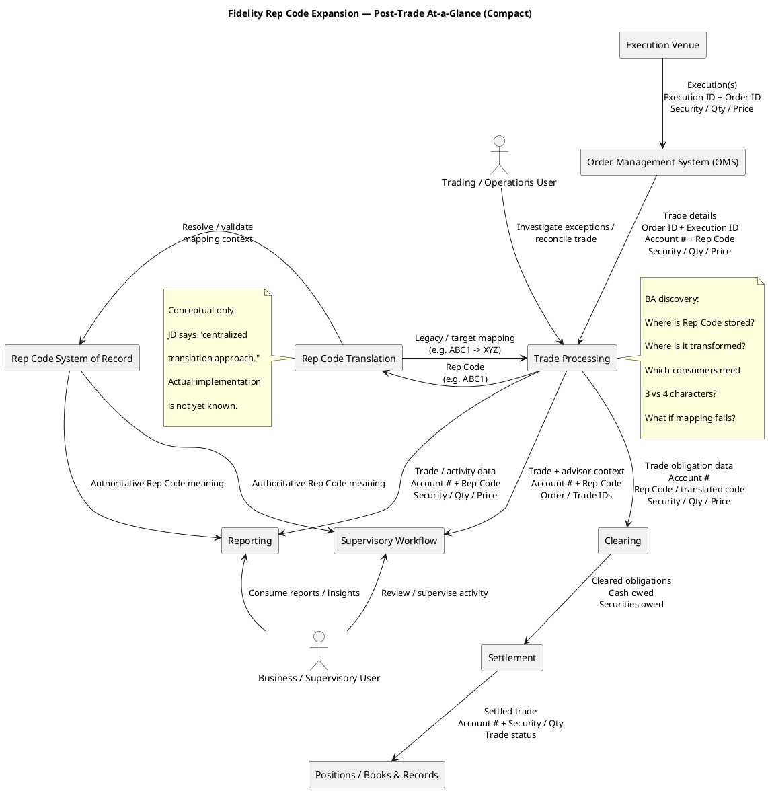
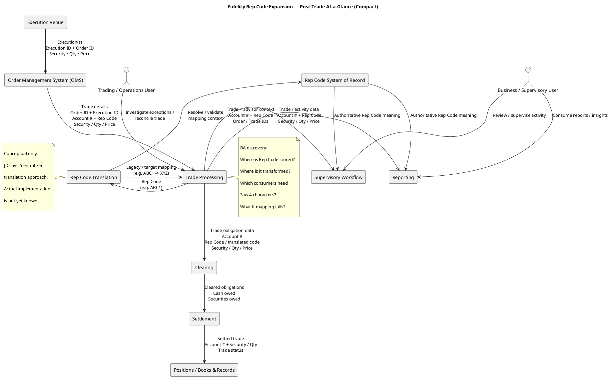

---
categories:
  - "[[Clippings]]"
title: Fidelity-Session 1--Brokerage and Wealth Management 101
source: https://chatgpt.com/g/g-p-69dd57df00d0819198410a853ec753d1/c/6a85c8ce-c900-83ea-a3c8-ebc097bd9285
author:
published:
created: 2026-08-21
description: The goal is to understand who the participants are, what the major business objects are, and what happens when somebody buys a security. The Fidelity JD tells us that Rep Code Expansion ultimately touches advisor structures, supervisory workflows, trading, clearing, operations, and integrations, so this foundation matters.
tags:
  - clippings
  - fidelity
url: https://chatgpt.com/g/g-p-69dd57df00d0819198410a853ec753d1/c/6a85c8ce-c900-83ea-a3c8-ebc097bd9285
---

---

# Session 1 — Brokerage & Wealth Management 101

Id like 20 shares of Apple
- i need access to the securities market place. So
- I open an (brokerage) account with a financial services (brokerage) firm, Fidelity
- Fidelity buys AAPL from the Market

so i the client paul has a brokerage account with fideltiy. I opened more. 
**I have multiple accounts**
→ Individual Brokerage Account  
→ Traditional IRA  
→ Roth IRA  
→ Joint Brokerage Account

each account can have different:
- owners, - tax treatment, - investment permissions, - restrictions, 
- advisors, - trading permissions, - assets
- reporting requirements

## Brokerage Account

it is the **business/legal container through which you hold and trade investments.**
The brokerage firm's systems maintain records describing things such as:

> Account 12345 belongs to Paul.
> Account 12345 owns 20 shares of AAPL.
> Account 12345 has $3,500 available **cash**.
> Account 12345 is permitted to perform certain types of trades.

## Broker-dealer

Broker-dealer is a **regulated financial firm involved in securities transactions.**
Broker-dealer is a regulated financial firm involved in securities transactions.

**Broker-dealer = regulated securities intermediary.**

consumer facing brand name and particular reguated broker-dealer legal entities are identical.

## Registered Representative

a registered representative is an individual registered to conduct particular securities business through a broker-dealer, subject to the appropriate registration and supervision.

## Order

- it's the instruction. "Buy 20 shares of AAPL."
## Execution

The market actually matches some or all of your order with somebody willing to sell. "20 AAPL executed at $225"

## Trade
- The resulting transaction created by that execution.

## One order multi-executions

Buy 1,000 shares.
- 400 execute at $225.00  
- 300 execute at $225.02  
- 300 execute at $225.05

## What happens after the trade?

Suppose your order executes.
Your screen may quickly show that you bought Apple.
But the f==inancial system isn't finished.==
The transaction must go through ==post-trade processing.==

**Order** ↓ **Execution** ↓ **Trade** ↓**Clearing** ↓ **Settlement**

## Clearing

Clearing is the process of determining and preparing the obligations created by the trade so they can be completed correctly.

 ecosystem has to establish:

> Who owes securities? > Who owes money?

> How much? > To whom?

Think of clearing as:

**"Figure out and prepare what everyone owes."**

## Settlement

Settlement is when the obligations are actually fulfilled.
Compete the exchange.

Buyer receives securities | Seller receives money

---
We now have:

**CLIENT** Paul ↓ 
**FINANCIAL ADVISOR / REGISTERED REP** Mary Jones ↓**REP CODE** DEF ↓ **ACCOUNT** 12345 ↓
**ORDER** Buy 20 AAPL ↓**EXECUTION** 20 AAPL @ market price ↓**TRADE** Transaction created ↓
**CLEARING** Obligations processed ↓
**SETTLEMENT** Cash/securities exchanged

---

Now imagine **DEF** appears throughout that ecosystem. Perhaps it exists in:

**Advisor system** ↓ **Account system** ↓ **Order system** ↓ **Trading system** ↓

**Clearing** ↓ 
**Supervisory system** ↓**Reporting** ↓
**External transmission**

---

## Expanding 3 to 4
Now Fidelity says:

> We're expanding three-character Rep Codes to four characters.

Old: **DEF** New: **DEF1**
#### Immediately, the BA should ask:

> Which systems know about DEF?
> Which systems store DEF?
> Which systems transmit DEF?

> Which databases define the field as three characters?
> Which applications validate exactly three characters?

> Which reports display it?
> Which external vendors receive it?
> Which business rules depend upon it?
> Which historical trades contain DEF?

> Which systems can accept DEF1?
> Which systems cannot?

That is why the actual JD says the initiative spans **core data models, supervisory workflows, trading, clearing and operational platforms**, while maintaining legacy compatibility through centralized translation.

And that's why **data lineage** is such an important requirement for your position.

---
## Brokerage vs Wealth Mgmt

- Brokerage: more transaction/account oriented.
- Wealth Mgmt: Broader relationship/advisory model.

There's overlap.

**advisor relationships eventually interact with brokerage/trading infrastructure**.

That's one reason something called a "Rep Code" can wind up affecting trading systems.

| Brokerage                                                                       | Wealth Mgmt                                                                                                                                                                    |
| ------------------------------------------------------------------------------- | ------------------------------------------------------------------------------------------------------------------------------------------------------------------------------ |
|  - Hold securities. - Buy/sell securities. - Process orders and trades | - financial planning - investment advice - portfolio management - retirement planning - tax-aware strategies - estate considerations - advisor relationships |

---

**Order = instruction**
**Execution = fulfillment/matching of that instruction**
**Trade = resulting transaction**

---

---

---

---

---

# Session 1 — What I want you to know

Don't memorize paragraphs. Make sure these ideas make sense:

1. **Client and account are different things.**
    
2. One client can have multiple accounts.
    
3. A **broker-dealer** facilitates securities transactions and operates in a regulated environment.
    
4. A **financial advisor** helps clients with financial/investment decisions.
    
5. A **registered representative/rep** is a registered securities professional associated with a broker-dealer.
    
6. A **Rep Code** is an identifier associated with the rep/advisor/business relationship and can matter to downstream business processes.
    
7. **Order ≠ execution ≠ trade.**
    
8. After execution come **clearing and settlement**.
    
9. Advisor/rep information can therefore travel into systems far beyond the advisor-facing application.
    
10. Changing an identifier from **3 → 4 characters** can consequently affect an enormous system ecosystem.
    

### The mental picture

Keep this one:

**Client → Advisor/Rep → Rep Code → Account → Order → Execution → Trade → Clearing → Settlement**

That's our foundation.

---

## Quick knowledge check

Before Session 2, answer these in your own words. Don't research them and don't worry about getting them perfect.

### **Q1.** What's the difference between a client and an account?

a client **doesn't necessarily need a financial advisor**. A self-directed Fidelity customer could have multiple brokerage/retirement accounts without working through an advisor.

> **Client = person/entity having the relationship with the firm. Account = a particular financial/legal container belonging to that client. One client can have multiple accounts.**

### **Q2.** What's the difference between an order and a trade?

> "Buy me 100 shares of IBM."

That's the **order**.

Suppose it gets filled:

> 20 IBM @ $250  
> 30 IBM @ $250.05  
> 50 IBM @ $250.10

Those are **executions/fills** of the order.

Those executions result in trade transactions.

**Order = instruction**
**Execution = fulfillment/matching of that instruction**
**Trade = resulting transaction**

And importantly, one order doesn't necessarily mean one execution.

**Q3.** Why might a financial firm use a Rep Code instead of simply storing the advisor's name?

**don't think of the Rep Code as an identifier for all of those things.**

At the basic level:

**Client ID → identifies client**
**Account ID → identifies account**
**Rep Code → identifies/represents the relevant representative/advisor relationship or business assignment**

The systems can then **relate** those things. For example:

**Account 12345 → assigned Rep Code DEF**

and:

**Rep Code DEF → Mary Jones / particular rep relationship**

So a system could determine:

> Account 12345 is associated with DEF.

and use reference data to determine what **DEF means**.

This distinction is going to become extremely important when we learn **systems of record and reference data**.

Also, Fidelity's JD tells us its rep codes have evolved beyond simply identifying individual advisors: clients use them for **individual advisors, teams, compensation structures and order-handling roles**. That's part of what has made the problem more complicated.

### **Q4.** Why could changing a Rep Code from three characters to four affect a trading system even though the code identifies an advisor rather than a security?

Suppose a legacy trading system was designed in 1995 to accept:

**REP_CODE = 3 characters**

Then Fidelity sends:

**ABC1**

The legacy system might:

reject it, truncate it to `ABC`, fail validation, corrupt/misinterpret it, 
or fail to process the message.

Meanwhile another modern system may happily accept `ABC1`. 

So the fundamental problem is:

**New 4-character world**

↓

`ABC1`

↓

**Legacy system only understands 3 characters**

💥

And that's why this phrase from the JD is so important:

> **"maintaining compatibility with legacy systems through a centralized translation approach."**

Eventually we're going to understand exactly what that could mean architecturally.

### **Q5.** What's the basic difference between clearing and settlement?

 but be careful with **who gets paid**. Suppose:

**Paul 
buys 100 IBM from Jane.**

Conceptually, at settlement:

**Paul/buyer's side → receives the securities**
**Jane/seller's side → receives the cash**

The broker isn't necessarily the seller receiving the purchase proceeds.

So retain:

> **Clearing = determine/prepare who owes what.**

> **Settlement = fulfill those obligations by completing delivery of securities and payment.**

That's enough for now.

---

You're getting the model. **Q1, Q2, and Q5 are essentially right. Q3 needs one important correction, and Q4 needs a slightly different emphasis.** Those corrections are useful because they lead directly into Rep Codes.

---

# Summary

Absolutely. Here's a compact **Session 1 + Session 2 review sheet**, incorporating the corrections we made to your answers. The Fidelity-specific framing is grounded in the JD, particularly its description of Rep Codes being used for advisors, teams, compensation structures, and order-handling roles.

Absolutely. Here's a compact **Session 1 + Session 2 review sheet**, incorporating the corrections we made to your answers. The Fidelity-specific framing is grounded in the JD, particularly its description of Rep Codes being used for advisors, teams, compensation structures, and order-handling roles.

## Session 1 — Brokerage & Wealth Management 101

|#|Review Question|Answer to Remember|
|---|---|---|
|**1**|**What's the difference between a client and an account?**|**Client = customer/person or entity. Account = financial/legal container holding the client's assets/activity.** One client can have multiple accounts. A client does not necessarily need an advisor.|
|**2**|**What's the difference between an order and a trade?**|**Order = instruction** to buy/sell. **Execution = the order (or part of it) gets filled. Trade = resulting transaction.** One order can have multiple executions.|
|**3**|**Why use a Rep Code instead of simply the advisor's name?**|Names aren't reliable unique business identifiers. A **Rep Code represents a relevant rep/advisor business relationship, assignment, team, role, etc.** It can be associated with accounts and activity and referenced consistently across systems.|
|**4**|**Why could changing a Rep Code from 3 → 4 characters affect trading systems?**|Systems may have been designed around exactly 3 characters—database fields, validations, APIs, files, business rules, interfaces, etc. A 4-character code could be **rejected, truncated, lost, mistranslated, or processed incorrectly.**|
|**5**|**What's the difference between clearing and settlement?**|**Clearing = determine and prepare what everyone owes. Settlement = fulfill those obligations**, completing delivery of securities and payment.|

### Session 1 flow to remember

**Client → Advisor/Rep → Rep Code → Account → Order → Execution → Trade → Clearing → Settlement**

One correction to keep in mind: an advisor isn't automatically assigned just because someone opens a brokerage account. The account may be **self-directed**.
