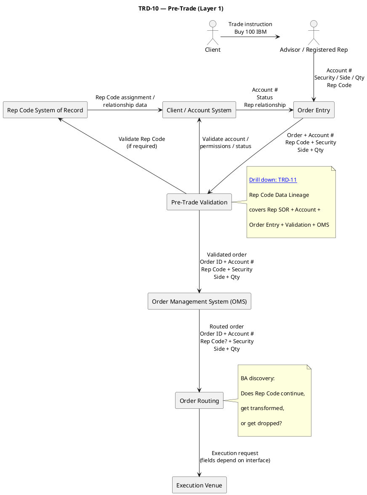
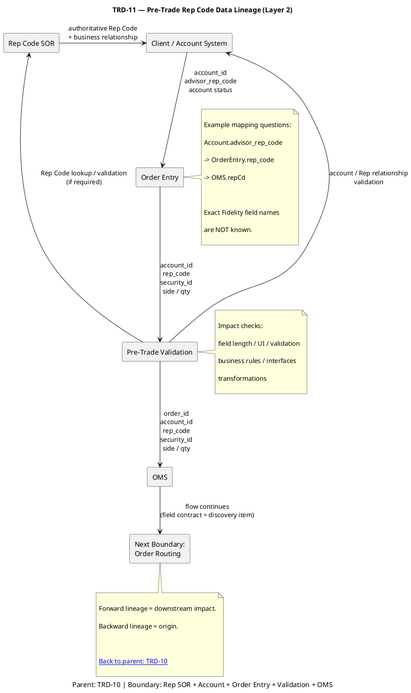
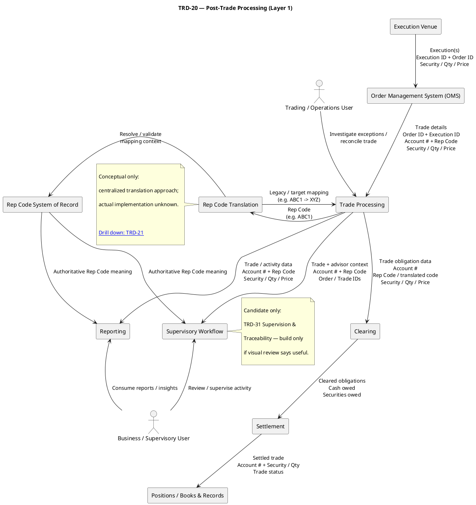
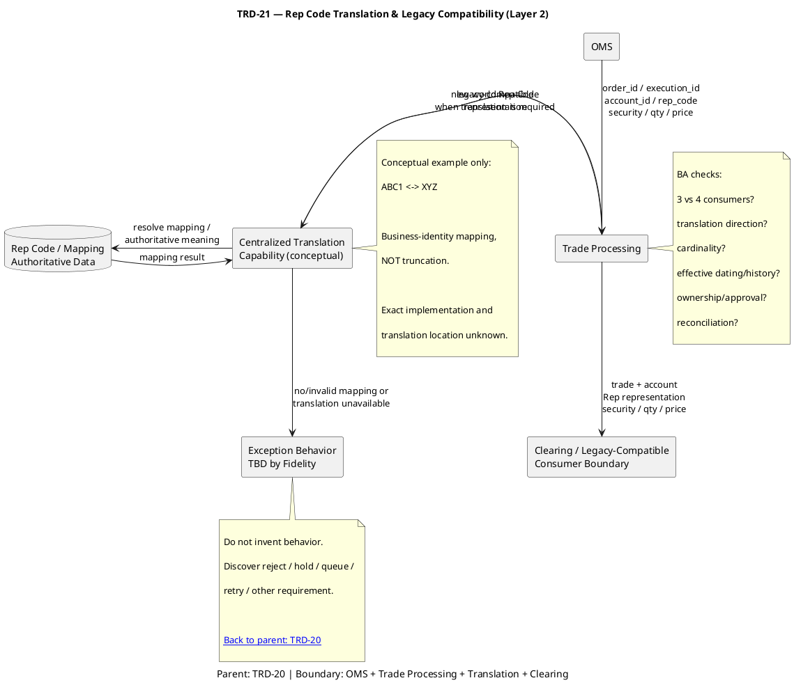

---
categories:
  - "[[Clippings]]"
title: Fidelity-Session 1-6 -- Consolidated Q and A
source: https://chatgpt.com/g/g-p-69dd57df00d0819198410a853ec753d1/c/6a85c8ce-c900-83ea-a3c8-ebc097bd9285
author:
published:
created: 2026-08-21
description: The Fidelity JD asks for an “understanding of regulatory environments.” For this role, I want you to understand why a seemingly technical identifier like Rep Code has implications for supervision, books and records, auditability, traceability, testing and controlled change.
tags:
  - clippings
  - fidelity
url: https://chatgpt.com/g/g-p-69dd57df00d0819198410a853ec753d1/c/6a85c8ce-c900-83ea-a3c8-ebc097bd9285
---
# TRD-10 - Pre-Trade Layer 1

---

---

# TRD-11 - Pre-Trade Rep Code Data lineage Layer 2

---

# TRD-20 - Post-Trade Processing Layer 1

---

---

## TRD-21 - Rep code translation & Legacy Compatibility Layer 2

---

|Session|Question / concept|Your resulting answer to retain|
|---|---|---|
|**1 — Brokerage 101**|Client vs. account|**Client** is the customer; one client can have multiple **accounts** at the financial-services firm.|
||Order vs. trade|**Order** expresses intent to buy/sell. Execution of the order creates trade activity.|
||Why Rep Code?|Connects activity to the relevant **registered-rep/advisor/business relationship**, rather than identifying the client.|
||Legacy compatibility|Systems designed around the old Rep Code construct can break when presented with a representation they don't support.|
||Clearing vs. settlement|**Clearing determines obligations — who owes what. Settlement fulfills them — securities and cash actually move.**|
|**2 — Rep Codes**|Employee ID vs. Rep Code|Employee ID identifies someone internally. Rep Code serves a **brokerage business/operational relationship** and can travel through financial workflows.|
||Does Rep Code identify client?|**No.** It relates to the representative/business relationship associated with the client/account/activity.|
||Why does wrong Rep Code matter?|It can break **lineage, attribution and reconciliation** across downstream processes.|
||System of Record|The **authoritative source of truth** for the data.|
||Data lineage|Trace the data from its origin through systems, transformations and consumers.|
|**3 — Trading Lifecycle**|Order → execution|Order represents intent; **execution occurs when some/all of it is filled**.|
||OMS|Receives/manages orders and participates in routing them toward execution.|
||Technical → business impact|Don't stop at “field supports only 3.” Explain what business capability can fail or become incorrect.|
||Starting impact discovery|Understand the **end-to-end As-Is Rep Code lifecycle** with a few connected systems and their inputs/outputs.|
||Important BA discipline|**Finding → business impact → solution/options.** Don't jump directly to an assumed solution.|
|**4 — Data & Lineage**|Source vs. SOR|Trading's immediate source may be OMS while the **Rep SOR remains the authoritative source**.|
||Lineage vs. mapping|**Lineage = path/journey. Mapping = correspondence between source and target fields/values.**|
||DBs both support 4 chars — enough?|**No.** Interfaces, validation, UI, rules, transformations and downstream consumers must also support the required representation.|
||`XYZ` in legacy system → authoritative code|Trace **backward lineage** toward the source/mapping.|
||Finding downstream impact|Trace **forward lineage** from the changed source.|
||`VARCHAR(10)` means system supports 4?|**No. Storage capability alone doesn't establish application/end-to-end capability.**|
|**5 — Rep Code Expansion**|Business problem|Existing Rep Code namespace/construct no longer adequately scales with Fidelity's growth and increasingly complex business structures.|
||Why phased change?|Systems have different owners/releases/dependencies; rollout must be **sequenced** without creating incompatible intermediate states.|
||Why not `ABC1 → ABC`?|Could create a technically valid but **incorrect existing code**, destroying business meaning.|
||Migration vs. coexistence|**Migration = movement toward target state. Coexistence = old/new capabilities operating together during transition.**|
||Missing translation|**Don't invent behavior.** Identify the exception and obtain required behavior from appropriate SMEs/Product/Operations.|
||OMS validation still requires 3|OMS is **not ready**, even if its DB/UI/interfaces support 4.|
||Field test vs. capability test|Accepting `ABC1` proves field support. **End-to-end testing proves the business process remains correct through validation, processing, translation, downstream use and reconciliation.**|
||Gap analysis|Compare **As-Is against To-Be**, then identify storage/UI/rule/interface/mapping/exception/testing/dependency gaps.|
|**6 — Regulatory Environment**|Trade succeeds with wrong Rep Code|Technical success doesn't equal business correctness. Wrong attribution can affect **supervision, reporting, records and traceability**.|
||Lineage and auditability|Lineage helps reconstruct **where data originated, where it traveled and how it transformed**.|
||Historical mappings|Need to understand what the Rep Code/business relationship **meant at transaction time**.|
||Preventive control|**Stops** an error—for example, reject an invalid Rep Code before processing.|
||Detective control|**Detects** an error—for example, reconciliation discovers incorrect translation.|
||BA vs. regulatory SME|SME interprets regulatory/business obligation; **BA translates it into process, data, system behavior, requirements, AC and testing.**|
||Your regulatory positioning|Experienced in **controlled financial environments**, data integrity, traceability, regression/UAT and controlled releases; work with regulatory SMEs rather than claiming regulatory expertise.|

---

### Six-session mental chain

You can now connect everything:

**Client / Account / Advisor**

→ **Rep Code**

→ **Order**

→ **OMS**

→ **Execution**

→ **Trade**

→ **Clearing**

→ **Settlement**

while simultaneously tracing:

**SOR → source → interface → mapping → transformation → downstream consumer**

and analyzing:

**As-Is → To-Be → gaps → requirements → AC → testing → release**

That's the framework we're building.

---

