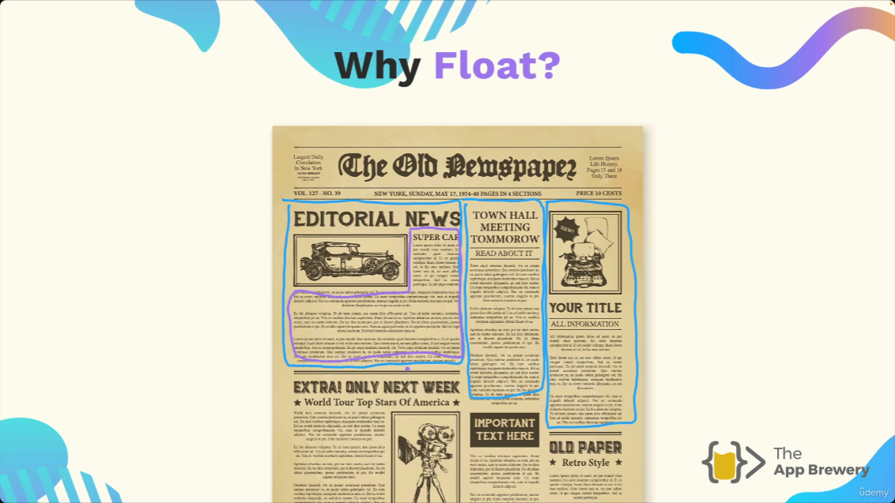
[00:00:55](https://www.udemy.com/course/the-complete-web-development-bootcamp/learn/lecture/37368102#overview)
![[screenshot-01KN03RYMA4NZSD7KHQK20EXQ9.png]]
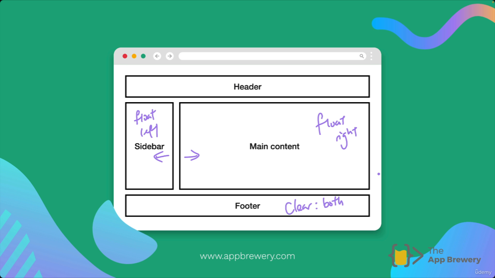

[00:06:04](https://www.udemy.com/course/the-complete-web-development-bootcamp/learn/lecture/37368102#overview)

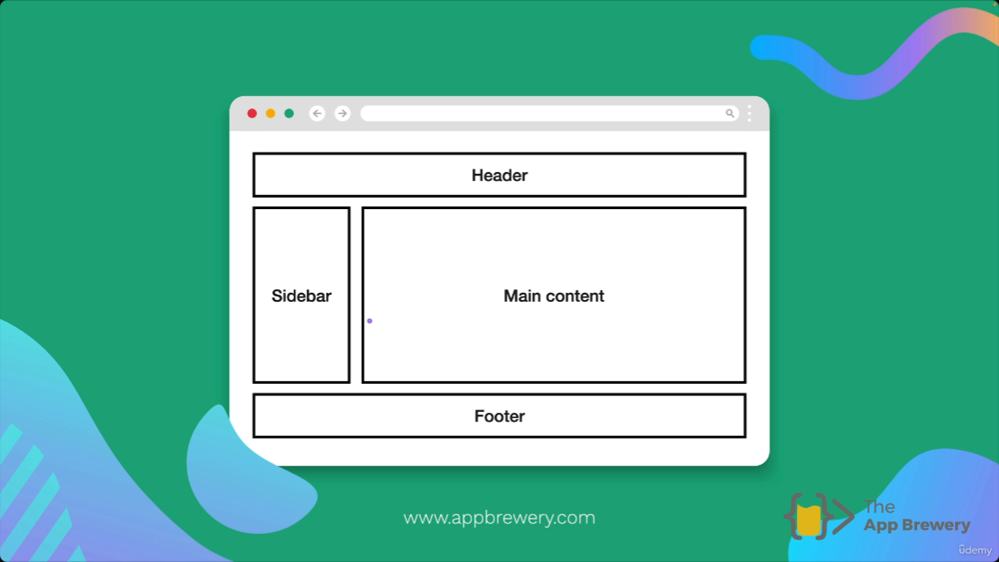
[00:05:44](https://www.udemy.com/course/the-complete-web-development-bootcamp/learn/lecture/37368102#overview)

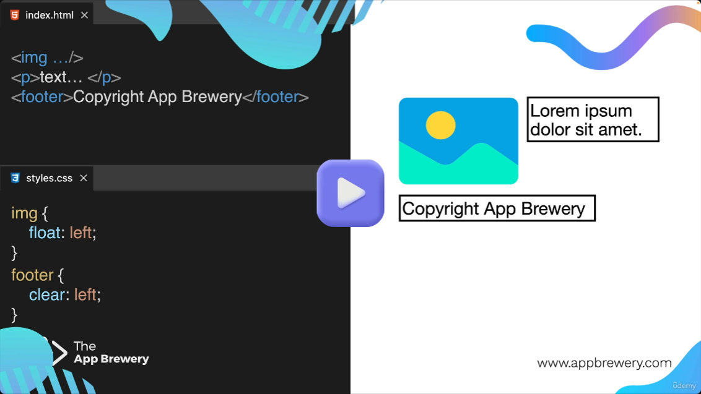
[00:05:35](https://www.udemy.com/course/the-complete-web-development-bootcamp/learn/lecture/37368102#overview)

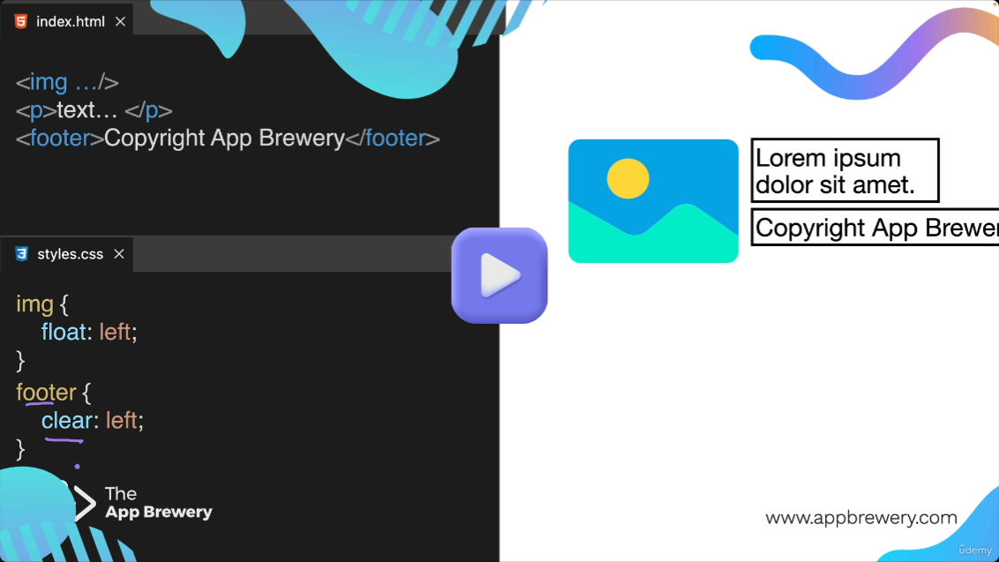
[00:05:18](https://www.udemy.com/course/the-complete-web-development-bootcamp/learn/lecture/37368102#overview)

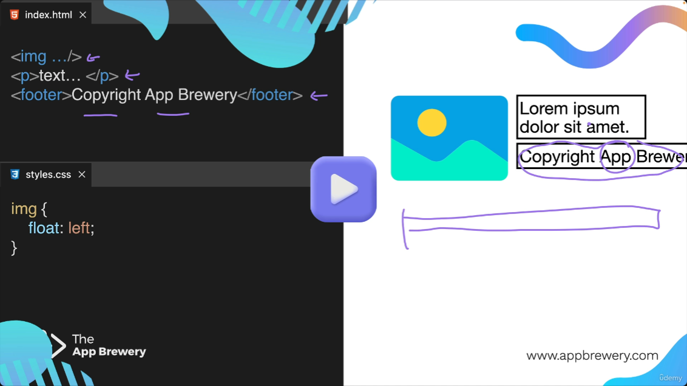
[00:04:56](https://www.udemy.com/course/the-complete-web-development-bootcamp/learn/lecture/37368102#overview)

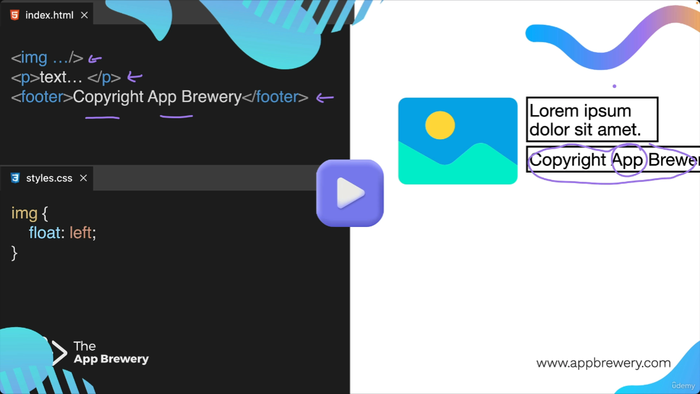
[00:04:52](https://www.udemy.com/course/the-complete-web-development-bootcamp/learn/lecture/37368102#overview)

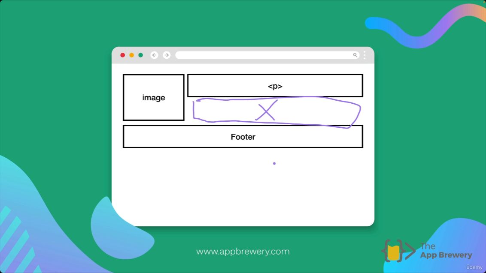
[00:04:04](https://www.udemy.com/course/the-complete-web-development-bootcamp/learn/lecture/37368102#overview)

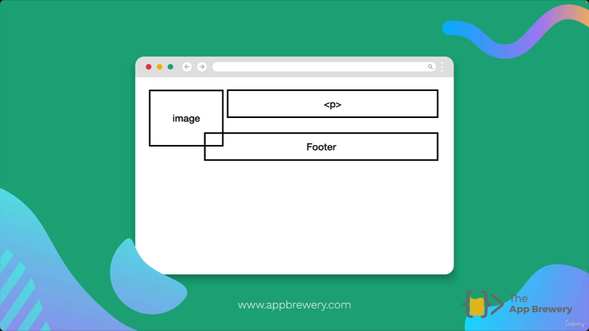
[00:03:56](https://www.udemy.com/course/the-complete-web-development-bootcamp/learn/lecture/37368102#overview)

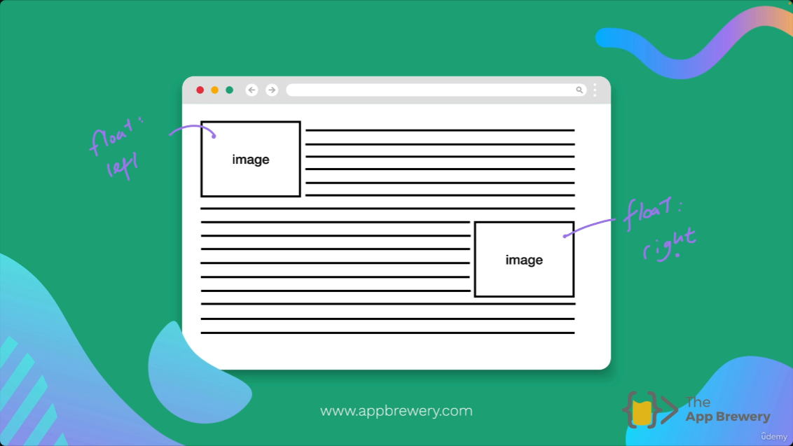
[00:03:18](https://www.udemy.com/course/the-complete-web-development-bootcamp/learn/lecture/37368102#overview)


[00:02:23](https://www.udemy.com/course/the-complete-web-development-bootcamp/learn/lecture/37368102#overview)

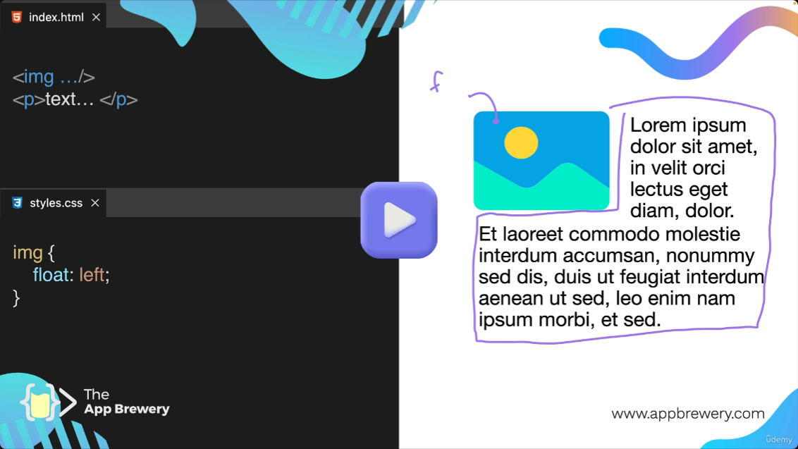
[00:02:19](https://www.udemy.com/course/the-complete-web-development-bootcamp/learn/lecture/37368102#overview)

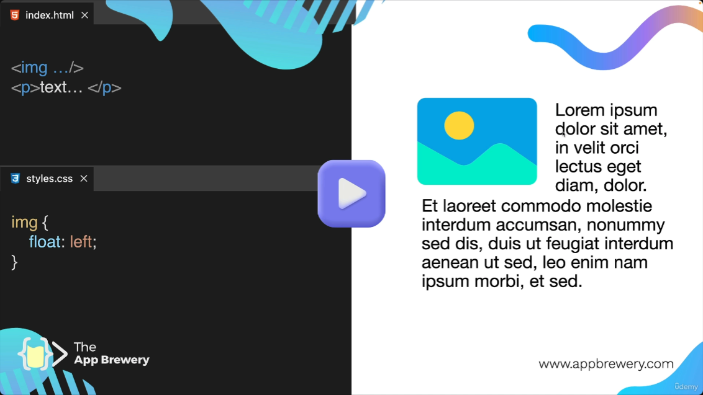
[00:02:10](https://www.udemy.com/course/the-complete-web-development-bootcamp/learn/lecture/37368102#overview)

## Float Property in CSS

- Inline blocks allow simple multi-column layouts (e.g., one here, another there, a third nearby)
    - But they don't let text wrap around irregular shapes like a misshapen L
- Use `float` property to enable text wrapping around other elements
    - Mimics newspaper-style layouts where text flows around images or boxes
- The web is an extension of print, inheriting these layout techniques

## Why Float?

- Newspaper layouts inspired modern website designs
    - Images and text arranged in columns and sections, directly borrowed for web pages
- Skills transfer across domains
    - Mastering newspaper layout transfers to web design even if original skill fades
    - Many real-world examples of reusing ideas in new contexts

### How to Use Float Property

- Basic implementation: target the image in CSS and set `float: left`
    - HTML structure:

```html

    <p>text...</p>
```

    - CSS:

```css
img {
      float: left;
    }
```

- `float` is the property name
    - Enables text to wrap around the floated image, as shown with lorem ipsum text flowing to the right of the image

### Float Property Values

- `float: left` makes the image float to the left, causing following text to wrap around its right side
    - No CSS needed on the text itself — the float property on the image handles the wrapping automatically
    - Visual result: text flows tightly around the image's right edge
- Change to `float: right` to float the image to the right instead
    - Text now wraps around the left side of the image

```css
img {
  float: left;  /* or float: right; */
}
```

### Default Display and Float Effects

- Only two values typically used for `float`: `left` and `right`
- Without `float`: images are `display: block` by default (take full width even if not needed), paragraphs are also `display: block` (full width), elements stack vertically in normal document flow
- With `float: right`: image floats to the right, text wraps around its left side

```css
img {
  float: right;
}
```

### Multiple Floats for Text Wrapping

- Apply `float: left` to one image and `float: right` to another image to make text wrap around both
    - Text flows between and around the floated images from both sides
- Floated elements are taken out of the normal HTML flow
    - They position themselves to the left or right while text content flows around them
    - Visual: images stay in place at edges, multiple `<p>` elements wrap dynamically around the floats

### Float Clearing with Footer

- Sometimes text wrapping around floated elements is undesirable
    - Example: floated image followed by paragraphs works well (text flows around)
    - But replace second `<p>` with `Footer` and it incorrectly wraps beside the image instead of spanning full width below

```html
  <p> (wraps right)  Footer (should be full width below)
```

- **Problem**: Footer gets pulled into the space beside the floated image rather than starting a new full-width section
    - Diagram shows image on left, first `<p>` wrapping right, footer squeezed beside instead of below everything

### Introduction to Clear Property for Float Clearing

- Use the `clear` property to prevent subsequent elements like footers from wrapping around floated images
    - Float is applied to the image (`img { float: left; }`), but it affects following elements (paragraphs wrap around it)
    - Problem: footer gets squeezed beside the floated image instead of spanning full width below

```html

<p>text...</p>
<footer>Copyright App Brewery</footer>
```

```css
img {
  float: left;
}
```

- **Desired layout**: image floated left with paragraph wrapping right, footer full-width below everything
    - Current weird result: footer positioned next to image like additional wrapped text (e.g., "Copyright App Brewery" beside image)
    - `clear` fixes this by making footer ignore the float and start fresh below

## Solving Float Wrapping Issues with `clear: left`

- Fix footer wrapping issue by targeting `footer` in CSS and adding `clear: left`
    - Clears responsibility to wrap around left-floated elements (like the image)
    - Allows footer to drop below the float and span full width

```css
img {
  float: left;
}

footer {
  clear: left;
}
```

- Result: text in `<p>` still wraps around image, but footer is free of the float and positions correctly below everything

### Clear Property Enables Common Layouts with Floats

- `clear` returns footer to its normal position and ignores floating elements
    - Allows footer to span full width below floated content without wrapping
- **Layout example**: Sidebar (`float: left`) + Main content (`float: right`) + full-width Header/Footer

```css
/* Sidebar */
  float: left;

  /* Main content */
  float: right;
```

    - Visual:

```javascript
+-----------------+------------------------+
    | Sidebar         | Main content           |
    |                 |                        |
    +-----------------+------------------------+
    | Footer (full width)                          |
    +----------------------------------------------+
```

    - `clear` on footer ensures it drops below both floats

### Clear Property Value `both`

- When using `float: left` for the sidebar and `float: right` for the main content, the footer needs to be cleared of both floats.
    - Set the `clear` property of the footer to `both` to prevent it from wrapping around either the left or right floated elements.

```css
footer {
  clear: both;
}
```

- Download and extract the 8.1 CSS Float starting files and open up the index.html.
- The index.html has code that's already written.
- The current preview has cats and dogs displayed.
- The goal is to achieve a certain layout as shown in the goal image.

## Current Inline-Block vs Desired Float Layout

- **Current issue with&#32;`display: inline-block`**: Two `<div>` blocks (`.cat` in aquamarine, `.dog` in coral, each `width: 40%`) stick side-by-side due to `display: inline-block`, but footer appears below without clearing issues; text stays contained in blocks (no wrapping around images)

```css
div {
  display: inline-block;
  width: 40%;
}
.cat {
  background-color: aquamarine;
}
.dog {
  background-color: coral;
}
```

- **Visual with inline-block**:

```javascript
+-----------------+   +-----------------+
|      CatCSS     |   |      DogCSS     |
| +-------------+ |   | +-------------+ |
| |             | |   | |             | |
| |    Cat      | |   | |   Puppies   | |
| |             | |   | |             | |
| +-------------+ |   | +-------------+ |
| Nap all day...  |   | Heckin good... |
+-----------------+   +-----------------+

<---- footer ---->
```

- **Desired float layout**: Switch to `float: left` on left block (e.g., cat sidebar) and `float: right` on right block (e.g., dog main content) for proper positioning with footer full-width below

### CSS Float Challenge Exercise

- **Task**: Modify the inline `<style>` in `index.html` using `float` to recreate the goal layout (shown in `goal.png`)
    - Float text (`<p>` elements) around images in their respective columns
    - Position `.cat` div to the left (`float: left`)
    - Position `.dog` div to the right (`float: right`)
    - Ensure `footer` appears full-width below both floated blocks (use `clear: both`)

**Current code structure**:

```html
<div class="cat">
  <h2>CatCSS</h2>
  
</div>
<div class="dog">
  <h2>DogCSS</h2>
  
</div>
<p>Nap all day cat dog... (text content)</p>
<p>Heckin good boys... (more text)</p>
<footer>
  <h2>Footer</h2>
</footer>
```

**Current CSS**:

```css
div {
  display: inline-block;
  width: 40%;
}
.cat { background-color: aquamarine; }
.dog { background-color: coral; }
footer { text-align: center; background-color: blueviolet; }
```

- **Target layout**: Two side-by-side columns (CatCSS left with cat image + wrapping text, DogCSS right with dog image + wrapping text), footer spanning full width below
    - Builds on float + clear concepts to create multi-column layout with text wrapping

### Starting the Float Challenge Solution: Text Wrapping Around Images

- **First step**: Float both images `left` to wrap their respective `<p>` text around them
    - Structure has `.cat` div with cat image + first paragraph, `.dog` div with dog image + second paragraph
    - Text currently contained in blocks; floating images allows wrapping within each column

```css
img {
  float: left;
}
```

- **Result**: Cat text flows around cat image in left column; dog text flows around dog image in right column
    - Builds on earlier float wrapping concept but applies to challenge exercise

### Next Step After Image Floating: Float the Cat Block Left

- After confirming text wraps around both images with `img { float: left; }` (works when there's sufficient width), next step is to float the `.cat` block to the left
    - Positions the cat column (CatCSS + image + wrapping text) to the left side of the page
    - Prepares for dual-column layout with dog column on the right

```css
img {
  float: left;
}

.cat {
  float: left;
  background-color: aquamarine;
}
```

## Float Cat and Dog Divs for Two-Column Layout

- **Goal**: Position `.cat` div (aquamarine block) to the left and `.dog` div (coral block) to the right using `float` to create side-by-side layout
- These blocks are simple `<div>` containers already targeted for background colors
- **Next action**: Apply `float: left` to `.cat` div (building on existing image float)

```css
.cat {
  float: left;
  background-color: aquamarine;
}
```

### Float Dog Div Right and Float Clearing Issue

- **Next step**: Apply `float: left` to `.cat` div and `float: right` to `.dog` div to position aquamarine block left and coral block right for two-column layout

```css
.cat {
  float: left;
  background-color: aquamarine;
}
.dog {
  float: right;
  background-color: coral;
}
```

- **Result after floating both divs**: Cat block correctly on left, dog block on right, but footer (copyright) moves up to top between them
    - Floats cause containing elements to collapse around floated content
    - Footer wraps around floats, occupying only center space between columns
- **Problem revealed**: Footer needs to appear full-width below both floated blocks instead of wrapping around them
    - Sets up need for `clear: both` trick on footer

### Completing the Float Challenge: Apply `clear: both` to Footer

- **Final step**: Add `clear: both` to `footer` to clear both left and right floats from `.cat` (`float: left`) and `.dog` (`float: right`)
    - Forces footer to drop below both floated columns, spanning full width

```css
footer {
  text-align: center;
  background-color: blueviolet;
  clear: both;
}
```

- **Result**: Layout now matches goal image (two-column with text wrapping images, footer properly positioned below)
    - Minor height gap between columns is normal (different text lengths in `.cat` vs `.dog` divs)
    - `clear: both` ensures footer clears *both sides* of the floats for proper behavior

**Full working CSS for challenge**:

```css
img {
  float: left;
  width: 40%;
}

.cat {
  float: left;
  background-color: aquamarine;
}

.dog {
  float: right;
  background-color: coral;
}

footer {
  text-align: center;
  background-color: blueviolet;
  clear: both;
}
```

## Limitations of Float for Modern Layouts

- **Historical use**: Developers used `float` extensively by 'wrangling' it for complex multi-column layouts like the cat/dog example
    - Required techniques like `clear: both` to control positioning
- **Modern practice**: Float is **not used** for layout designs in current web development
    - Better, more reliable tools exist (teased for future coverage)
    - This demo teaches `clear` property mechanics, not production layout technique

### Recommended Modern Use of Float

- **Primary recommendation**: Only use `float` when you want to wrap text around an image
    - Avoid for complex layouts (like the cat/dog two-column example) because it leads to unexpected results
- **Modern alternatives** (simpler and more reliable): Flexbox, Grid, Bootstrap, and other tools
    - These replace float-based layouts in current web development
    - Most developers follow this practice
- **Why learn float anyway?** Important concept to understand text wrapping behavior and `clear` mechanics
    - Builds foundation even if rarely used for layouts

## Advice on Using Float Sparingly

- **Key advice from instructor**: Understand float mechanics, but **try not to use it on everything that you see**
- Better layout techniques will be taught very shortly