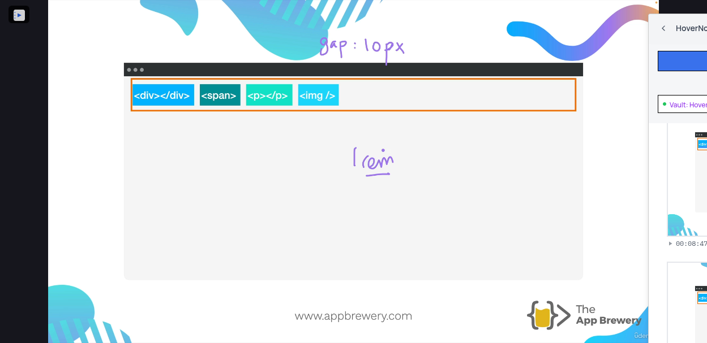
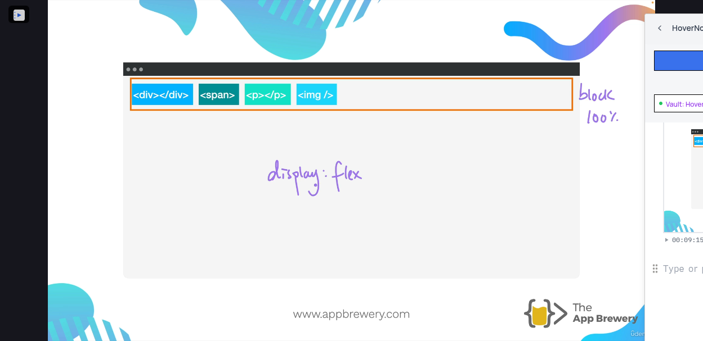
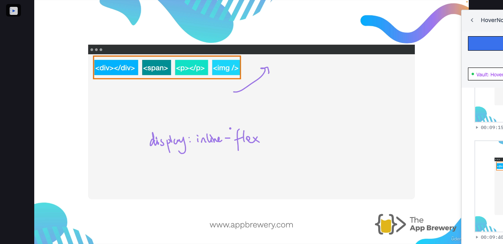
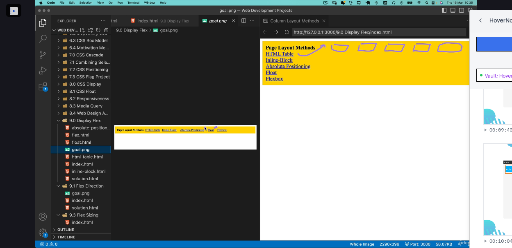
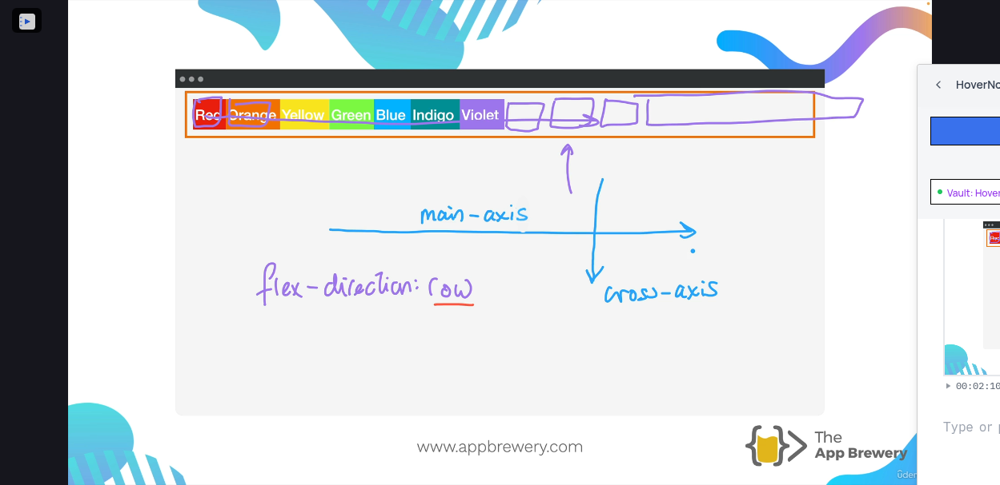
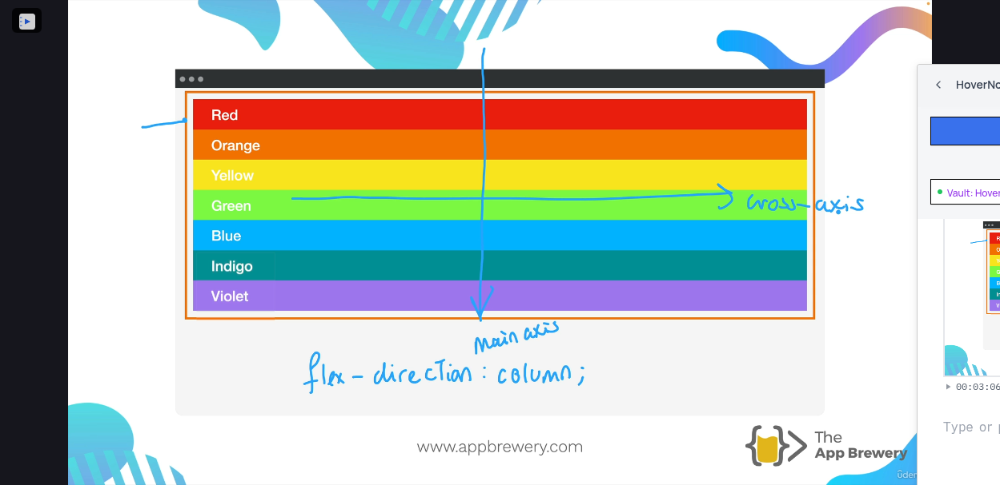
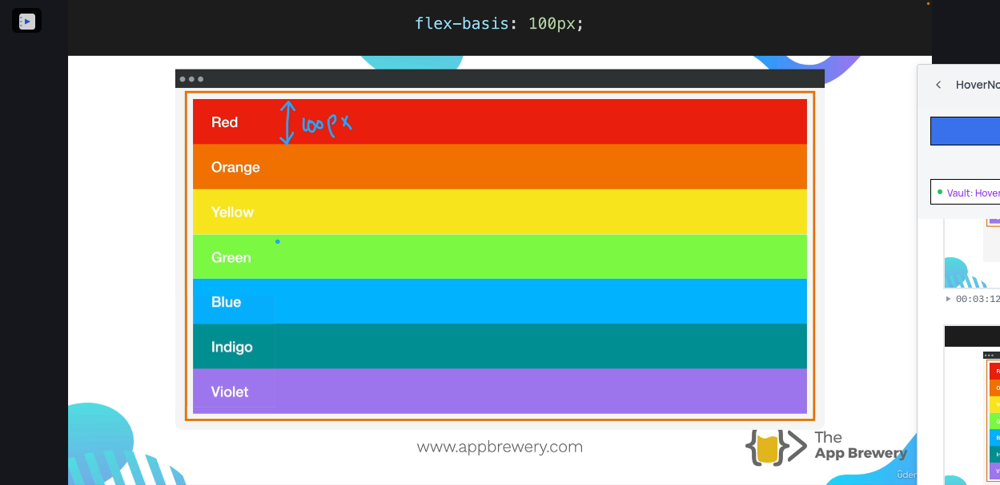
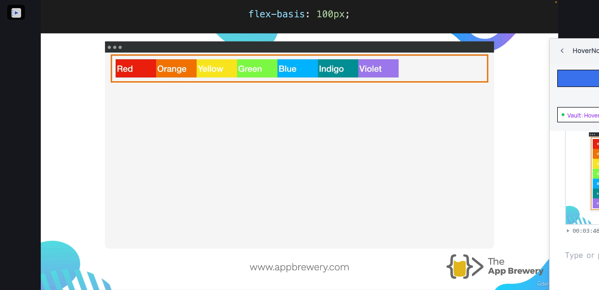
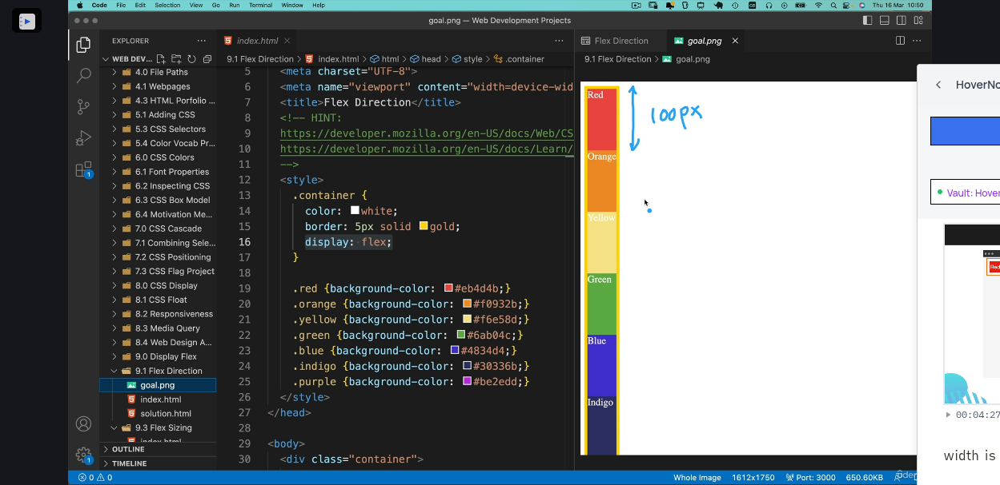

[00:09:06](https://www.udemy.com/course/the-complete-web-development-bootcamp/learn/lecture/37368230#overview)


[00:09:15](https://www.udemy.com/course/the-complete-web-development-bootcamp/learn/lecture/37368230#overview)


[00:09:40](https://www.udemy.com/course/the-complete-web-development-bootcamp/learn/lecture/37368230#overview)


[00:10:04](https://www.udemy.com/course/the-complete-web-development-bootcamp/learn/lecture/37368230#overview)


[00:12:25](https://www.udemy.com/course/the-complete-web-development-bootcamp/learn/lecture/37368230#overview)

# Flex direction

[00:02:10](https://www.udemy.com/course/the-complete-web-development-bootcamp/learn/lecture/37368266#overview)


[00:02:30](https://www.udemy.com/course/the-complete-web-development-bootcamp/learn/lecture/37368266#overview)
[00:03:06](https://www.udemy.com/course/the-complete-web-development-bootcamp/learn/lecture/37368266#overview)


[00:03:44](https://www.udemy.com/course/the-complete-web-development-bootcamp/learn/lecture/37368266#overview)


[00:03:48](https://www.udemy.com/course/the-complete-web-development-bootcamp/learn/lecture/37368266#overview)


[00:04:27](https://www.udemy.com/course/the-complete-web-development-bootcamp/learn/lecture/37368266#overview)

width is changed for row


[00:06:07](https://www.udemy.com/course/the-complete-web-development-bootcamp/learn/lecture/37368266#overview)

flex-basis is set on child items and not on the container

use only css to target divs look at hint in index.html

## Child combinator

The **child combinator** (`>`) is placed between two CSS selectors. It matches only those elements matched by the second selector that are the direct children of elements matched by the first. Descendant elements further down the hierarchy don't match. For example, to select only `<p>` elements that are direct children of `<article>` elements:

```javascript
article > p {
  /* … */
}
```

# Universal selectors

```javascript
/* Selects all elements */
* {
  color: green;
}
```

by default, display: flex; will occupy the full width

inline-flex will occupy widest bit of content as width

flex-basis need to apply to flex items and not the parent container. So need to target all of div's children. so use combinators direct children