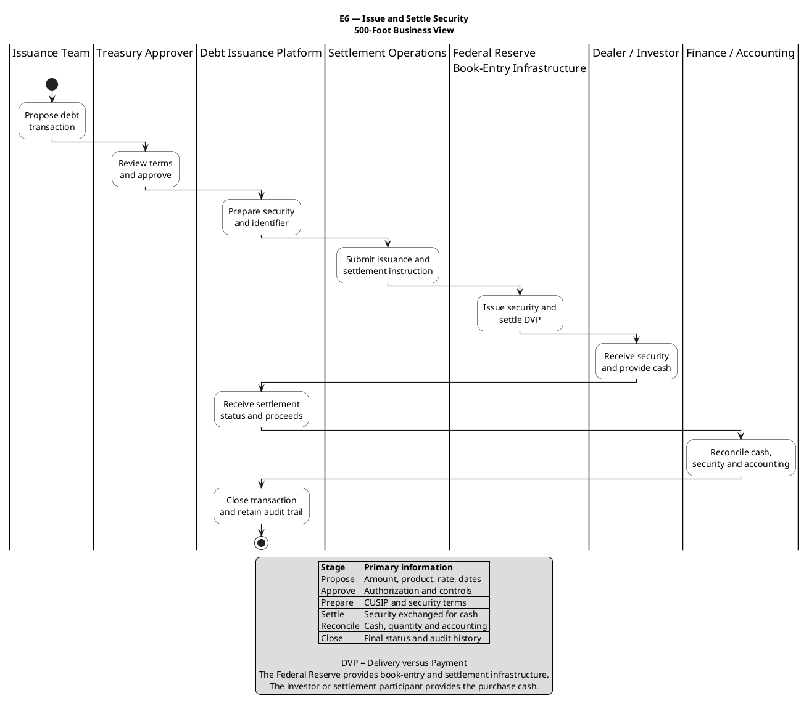

# E6-00-issue-and-settle-security-500-foot-business-view

## Business Question

How does a debt transaction move from proposal through issuance, settlement, reconciliation, and closure?

## Purpose

Provide a single executive-level view of the end-to-end business capability without implementation detail.

## How to Explain It

This is the 500-foot view of the debt issuance lifecycle. It starts with the issuance team proposing a transaction, moves through Treasury approval, security preparation, settlement through Federal Reserve book-entry infrastructure, receipt of cash from the dealer or investor, reconciliation, and final closure. I would use this diagram first with executives or new team members because it establishes the complete business context before drilling into E6-01.

## Key Talking Points

- The process crosses business, platform, settlement, market participant, and accounting boundaries.
- Approval is only one stage in a larger issue-and-settle lifecycle.
- Delivery versus payment links the movement of the security to receipt of cash.
- The final outcome includes reconciliation and a retained audit trail.

## What This Diagram Does Not Show

Detailed approval rules, field-level requirements, exception handling, or system interactions.

## Position in the Visual Decomposition

`L0 Executive Overview`

## Related Artifacts

- [[EPIC-E6-issue-and-settle-security]]
- [[FEATURE-E6-01-propose-and-approve-debt-transaction]]
- [[E6-00-issue-and-settle-security-500-foot-business-view]]
