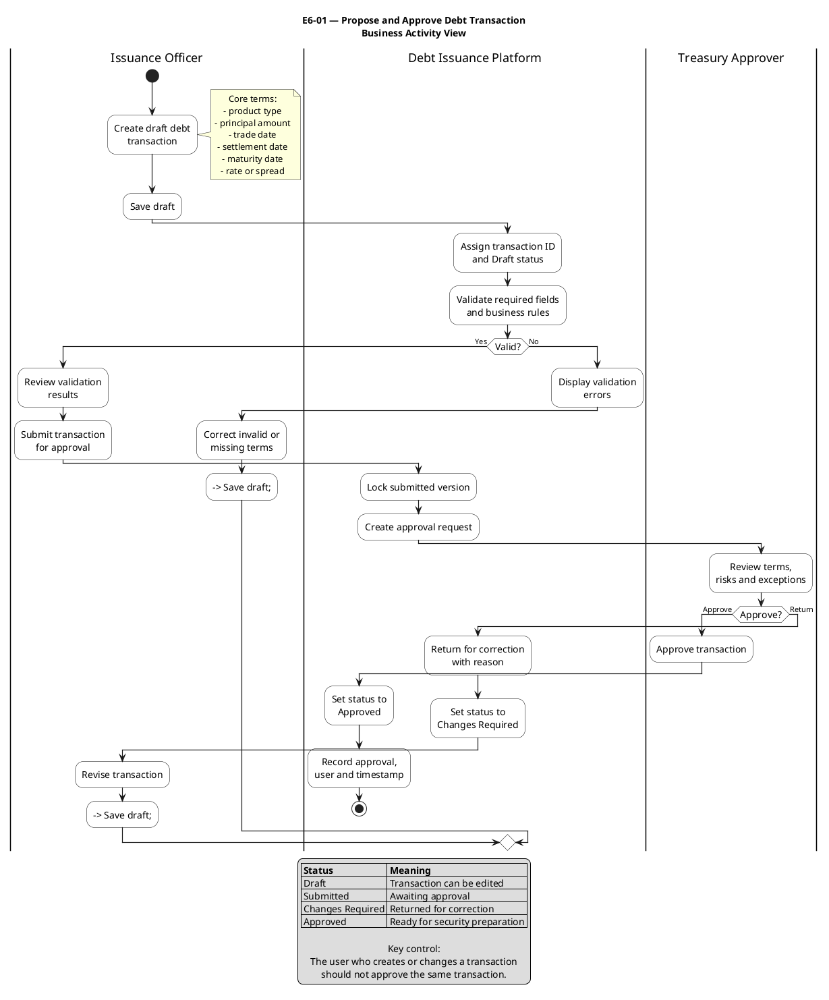

---

---

# E6-01A-propose-and-approve-debt-transaction-business-activity-view

## Business Question

What business activities and status changes occur when a debt transaction is proposed and approved?

## Purpose

Show the main workflow, actors, validation loops, approval decision, and return-for-correction path.

## How to Explain It

This diagram shows the full business workflow for E6-01. The Issuance Officer creates and saves a draft, the platform assigns an ID and validates it, and a valid proposal is submitted as a locked version for Treasury review. The approver can approve it or return it with a reason. Invalid or returned transactions loop back for correction. The key point is that the workflow is controlled by both business validation and independent approval.

## Key Talking Points

- Draft transactions remain editable.
- Submission creates a controlled version for review.
- Returned transactions enter Changes Required status.
- Approval records the approver and timestamp.
- The proposer should not approve the same transaction.

## What This Diagram Does Not Show

Detailed message exchanges, individual business rules, or field-by-field data evolution.

## Position in the Visual Decomposition

`L1 Business Workflow`

## Related Artifacts

- [[EPIC-E6-issue-and-settle-security]]
- [[FEATURE-E6-01-propose-and-approve-debt-transaction]]
- [[E6-01A-propose-and-approve-debt-transaction-business-activity-view]]
