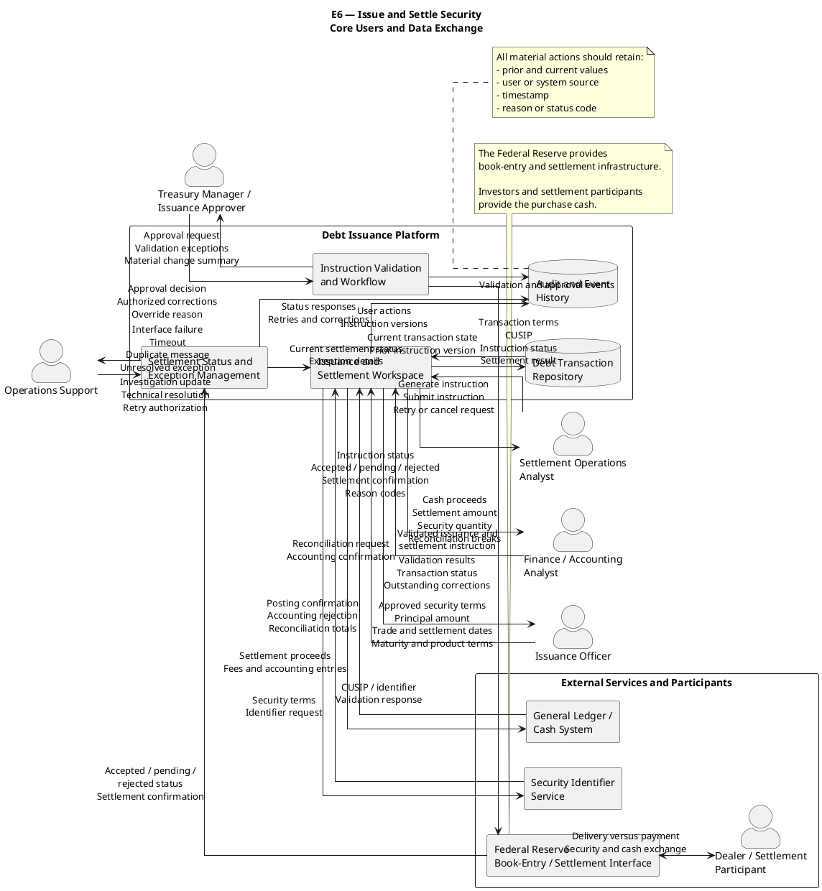

```puml
@startuml
title E6 — Issue and Settle Security\nCore Users and Data Exchange

left to right direction
skinparam shadowing false
skinparam packageStyle rectangle
skinparam actorStyle awesome
skinparam linetype ortho

actor "Issuance Officer" as IssuanceOfficer
actor "Treasury Manager /\nIssuance Approver" as Approver
actor "Settlement Operations\nAnalyst" as SettlementOps
actor "Finance / Accounting\nAnalyst" as Finance
actor "Operations Support" as OpsSupport

rectangle "Debt Issuance Platform" as Platform {

  rectangle "Issuance and\nSettlement Workspace" as Workspace

  rectangle "Instruction Validation\nand Workflow" as Validation

  rectangle "Settlement Status and\nException Management" as Exceptions

  database "Debt Transaction\nRepository" as DebtRepo

  database "Audit and Event\nHistory" as AuditRepo
}

rectangle "External Services and Participants" {

  rectangle "Security Identifier\nService" as IdentifierService

  rectangle "Federal Reserve\nBook-Entry / Settlement Interface" as FedInterface

  actor "Dealer / Settlement\nParticipant" as Dealer

  rectangle "General Ledger /\nCash System" as GL
}

IssuanceOfficer --> Workspace : Approved security terms\nPrincipal amount\nTrade and settlement dates\nMaturity and product terms

Workspace --> IssuanceOfficer : Validation results\nTransaction status\nOutstanding corrections

Approver --> Validation : Approval decision\nAuthorized corrections\nOverride reason

Validation --> Approver : Approval request\nValidation exceptions\nMaterial change summary

SettlementOps --> Workspace : Generate instruction\nSubmit instruction\nRetry or cancel request

Workspace --> SettlementOps : Instruction status\nAccepted / pending / rejected\nSettlement confirmation\nReason codes

Finance --> Workspace : Reconciliation request\nAccounting confirmation

Workspace --> Finance : Cash proceeds\nSettlement amount\nSecurity quantity\nReconciliation breaks

OpsSupport --> Exceptions : Investigation update\nTechnical resolution\nRetry authorization

Exceptions --> OpsSupport : Interface failure\nTimeout\nDuplicate message\nUnresolved exception

Workspace --> IdentifierService : Security terms\nIdentifier request

IdentifierService --> Workspace : CUSIP / identifier\nValidation response

Validation --> FedInterface : Validated issuance and\nsettlement instruction

FedInterface --> Exceptions : Accepted / pending /\nrejected status\nSettlement confirmation

FedInterface <--> Dealer : Delivery versus payment\nSecurity and cash exchange

Exceptions --> Workspace : Current settlement status\nException details

Workspace --> GL : Settlement proceeds\nFees and accounting entries

GL --> Workspace : Posting confirmation\nAccounting rejection\nReconciliation totals

Workspace --> DebtRepo : Transaction terms\nCUSIP\nInstruction status\nSettlement result

DebtRepo --> Workspace : Current transaction state\nPrior instruction version

Validation --> AuditRepo : Validation and approval events

Workspace --> AuditRepo : User actions\nInstruction versions

Exceptions --> AuditRepo : Status responses\nRetries and corrections

note bottom of FedInterface
The Federal Reserve provides
book-entry and settlement infrastructure.

Investors and settlement participants
provide the purchase cash.
end note

note bottom of AuditRepo
All material actions should retain:
- prior and current values
- user or system source
- timestamp
- reason or status code
end note

@enduml
```