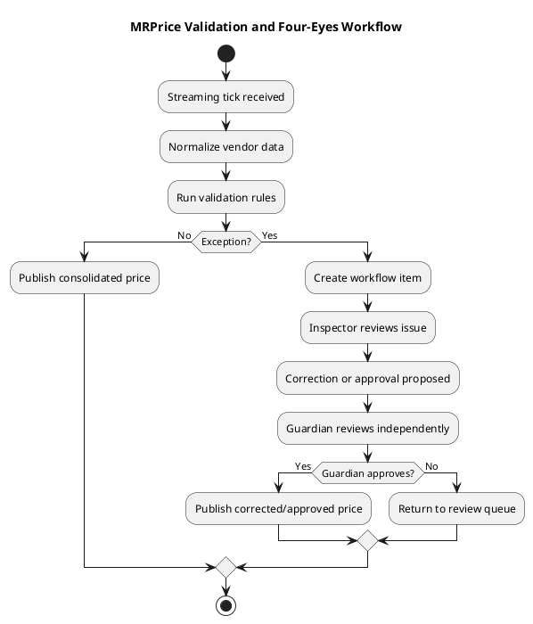

```plantuml
@startuml

title MRPrice Validation and Four-Eyes Workflow

start

:Streaming tick received;
:Normalize vendor data;
:Run validation rules;

if (Exception?) then (No)
  :Publish consolidated price;
else (Yes)
  :Create workflow item;
  :Inspector reviews issue;
  :Correction or approval proposed;
  :Guardian reviews independently;

  if (Guardian approves?) then (Yes)
    :Publish corrected/approved price;
  else (No)
    :Return to review queue;
  endif
endif

stop

@enduml

```